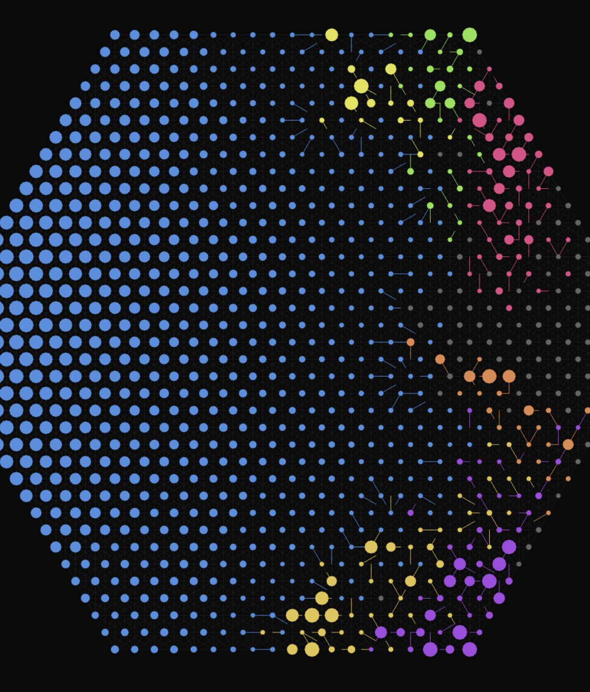

## Goal

Tell the evolution-arc story in under a minute: hand-written heuristic versus naïve nets → swap in champions across generations → final champion dominates. The visual is the pitch; flow lines and ownership cascades carry the story without voiceover.

## The two frames that sold the idea

These are the reference frames the demo recreates. They came out of unscripted play and are why this work exists.

*Baseline. The hand-written `aggressive` (seat 0) versus eleven untrained `evolved` nets. The shape is the point — strength-scaled nodes plus colored half-edges read as living vasculature.*

*After evolution. One champion expands as a deliberate blue mass; the other seats are reduced to coloured perimeter skirmishes. Same engine, same rules — only the genome changed.*

## Two ways to ship it

| | (A) edited video | (B) in-browser scripted demo *(canonical)* |
|---|---|---|
| medium | mp4/webm | live URL — `/?demo=1` |
| dependency | ffmpeg + screen recorder | nothing new — runs the deployed app |
| size | ~5–10 MB | ~290 KB extra (four champion JSONs) |
| editable | re-record + re-edit per change | bump a constant or swap a champion JSON |
| works where? | everywhere, including social previews | anywhere JS runs |
| smoke-testable in CI | no | yes — Playwright walks the demo |
| canonical? | secondary | **primary** |

We ship (B). (A) stays as a derivative — point Playwright at the demo URL to record a reproducible video for places JS can't reach.

## The arc (~30s, five scenes + intro)

Seat 0 is always `aggressive`; the other eleven seats are `evolved` and all read the same module-global champion (set in `src/gpu/evolved.ts`). Each scene is pre-simmed off-screen under its own champion, then played back as a snapshot stream over 5s wall-clock — see "Pre-sim + playback architecture" below.

| scene | label | caption | duration | champion file |
|---|---|---|---|---|
| 1 | `gen0`    | "watch ai battle"                 | 5s | `null` — fresh random genome via `ensureChampion()` |
| 2 | `gen100`  | "the blue one is code"            | 5s | `gen100.json` *(placeholder, see below)* |
| 3 | `gen50`   | "the others are neural nets"      | 5s | `gen50.json`  *(placeholder)* |
| 4 | `gen2000` | "they start to learn (gen 150)"   | 5s | `stalemate.json` — user-evolved gen 153 (saved from in-app GPU loop) |
| 5 | `gen20k`  | "they win (gen 12k)"              | 5s | `strong.json` — real saved champion (gen 12228) |

Captions are lowercase by design. Scene 4's caption rounds gen 153 → "gen 150"; scene 5's rounds gen 12228 → "gen 12k". The runner cycles back to scene 1 after scene 5, so the demo loops indefinitely. Scene ordering is intentionally narrative-first (introduce the code seat before the NN seats) and breaks numerical gen order — scene 3 is gen 50, scene 2 is gen 100.

### Pre-sim + playback architecture

The demo does **not** step the sim live. Doing so would couple frame rate to sim cost and stutter on slow devices. Instead each scene is a **pre-computed snapshot array**, played back frame-by-frame in exactly 5s wall-clock:

1. **Pre-sim phase (off-screen).** Set the champion via `setChampion()`. Build initial state with `makeInitialState(undefined, undefined, 12)`. Loop `step(s, 0.1)` + (every 5 ticks) the 12-seat AI thinks (`applyAction` for every action each seat returns) for `PRESIM_TICK_BUDGET = 5000` ticks (or until early-exit — see below). Push every `SNAPSHOT_STRIDE = 5` ticks into `snapshots: GameState[]` (caps frames per scene at ~1000). Yield via `await new Promise(r => setTimeout(r, 0))` every 50 ticks so the main thread breathes.
2. **Playback phase (5s wall-clock).** Each frame compute `t = sceneElapsed / 5s`, pick `snapshots[Math.floor(t * expectedLength)]` (clamped to actual length so partial pre-sims gracefully stall on the latest available frame), hand it to `updateScene(scene, snap, null)`. No `step()` calls during playback. Frame rate is decoupled from sim cost.

**Early-exit conditions** (any one stops the pre-sim loop):
- **Winner emerges.** A single non-null owner remains. Default `stopOnWinner = true`; per-scene `SceneSpec.stopOnWinner` can flip it false.
- **Adaptive churn truncation.** Every `STASIS_SAMPLE_PERIOD = 5` ticks, compute the inter-sample delta sum `Σ_p |count[p][t] - count[p][t-1]|`. Keep a rolling `STASIS_WINDOW = 50` of those deltas; the window mean is the **current churn rate**. Track the peak window-mean ever reached this game. When current drops below `CHURN_RATIO = 0.15` of peak — i.e., movement has decayed to 15% of the liveliest moment — declare stalemate. Continue until the kept tick range satisfies `(t - t_stalemate) / t ≤ STALEMATE_TAIL_FRAC = 0.30`, then break. Result: stalemate tail occupies ≤ 30% of total kept ticks regardless of how long the game took to settle. We deliberately do **not** reuse `src/sim/stasis.ts` `detectStasis()` — it suppresses 1v1 endgame and cleanup phases for in-game UX, but for playback we want to truncate any flat region.

Because `setChampion()` is module-global state in `src/gpu/evolved.ts`, the five scene pre-sims must run **sequentially** — kicked off as a chained promise during `enter()`. Scene 0's pre-sim is awaited before the intro animation begins; scenes 1–4 race against playback wall-clock and almost always finish in time. `expectedLength` locks in once a pre-sim finishes — if a scene early-exits (winner or churn truncation), `expectedLength` shrinks accordingly so playback's `t→idx` mapping uses the true span. Memory cost: with 5-tick stride, ≤ 1000 frames × ~1027 nodes per scene; cheap because `step` doesn't mutate, so snapshots share most structure by reference.

**Per-scene overrides (`SceneSpec` optional fields):**
- `tickBudget` — override `PRESIM_TICK_BUDGET` for this scene.
- `stopOnWinner` — set false if the scene should keep stepping past winner (useful when truncation will catch the flat tail instead).
- `stillUrl` — load a baked final-state JSON instead of pre-simming live. Loader rebuilds the GameState by calling `makeInitialState(radius, distance, numPlayers)` from the still's `boardConfig`, then overriding `owners`, `strengths`, and `flows` per the file. Used historically for `gen2000` while we baked the trainer's output; currently unused (replaced by `stalemate.json` live presim) but kept in the loader for future single-frame scenes.

### Intro framing

Before scene 1, the runner pre-sims an off-screen game under the gen0 champion (random genome) for 150 ticks via the same `presimGame()` helper used for the scenes. From the last snapshot it computes a **hot area** — the length-weighted centroid of *cross-owner* flow midpoints (attacks across borders; the visually interesting flows). Falls back to centroid of all flows, then to origin if there are no flows yet. The intro then displays that frozen last snapshot while the camera pans + zooms to the hot point over 1s, holds the "AI WARS" title card for 1.5s, and zooms back to the wide view (0.7s). Only the camera animates during the intro; the rendered game state stays still.

Phase sequence per cycle: `intro-pan` (1.0s) → `intro-title` (1.5s, title card "AI WARS") → `intro-zoom-out` (0.7s) → for each scene: `scene-caption-in` (0.6s) → `scene-hold` (5s − 2×0.6s) → `scene-caption-out` (0.6s) → next scene. The scene-phase trio share one monotonic `sceneElapsed` counter so snapshot sampling is continuous across all 5s.

## What landed

Files under `src/demo/` and `public/champions/`:

- **`src/demo/runner.ts`** — scene state machine + pre-sim/playback engine. Public API: `createRunner({scene, overlay})` returns `{enter, tick, isActive, currentSnapshot, currentScene}`. Exports `SCENES` (the data list above) and `pickHotArea(state)`. The runner owns champion loading and pre-sim; the host only feeds it `dt`. Internals: `presimGame()` runs `step` (`dt=0.1`) plus the 12-seat AI every 5 ticks into a caller-provided snapshot array, breaking out early on a single-owner win and yielding every 50 ticks; `sampleSnapshot()` maps playback `t` to an index using the scene's `expectedLength` (which locks in to the actual recorded length once pre-sim finishes). Camera moves via existing `setViewSize` / `panBy` / `clampCamera` from [[../entities/flux]] (`src/render/scene.ts`); lerp + ease-in-out is inlined, no animation framework.
- **`src/demo/overlay.ts`** — pure DOM. `createOverlay()` returns `{showTitle, hideTitle, showCaption, hideCaption, destroy}`. Title is centered mono (`clamp(40px, 8vw, 96px)`, letter-spacing 8); caption sits in the bottom third (`clamp(20px, 3.2vw, 40px)`, letter-spacing 3). Both fade via CSS opacity transitions; container is `pointer-events:none` so input still reaches the canvas.
- **`src/demo/champions.ts`** — `loadSceneChampion(label) → Promise<Float32Array | null>`. Reads `public/champions/index.json`, fetches the mapped file, parses `weights`. Returns `null` for `gen0` so `ensureChampion()` in `src/gpu/evolved.ts` mints a fresh random genome.
- **`src/main.ts`** — `?demo=1` URL trigger sets `DEMO_MODE`. In that mode lil-gui (`gui.hide?.()`), `#flux-topbar`, `#hud`, the hint, and `#install-banner` are all `display:none`. The frame loop's runner branch is dead-simple: `runner.tick(dt)` → `updateScene(scene, runner.currentSnapshot(), null)` → `render(scene)`. The normal sim path is skipped entirely while the runner is active, so the live `state` variable, winner detection, and stasis detection all sit dormant. (No banner suppression hack needed — the live path simply doesn't execute.)

Champions in `public/champions/`:

| file | size | source |
|---|---|---|
| `gen50.json`    | 76K | placeholder, `mulberry32(50)`   + Gaussian `std=0.03` — sluggish-looking early-net feel |
| `gen100.json`   | 74K | placeholder, `mulberry32(100)`  + Gaussian `std=0.08` |
| `gen2000.json`  | 73K | CPU-evolved from `strong.json` (warm-start σ=0.4) for stalemate at tick 4000 — kept on disk as a fallback but not currently wired to any scene |
| `stalemate.json`| 71K | user-saved gen 153 from in-app GPU evolution in a separate browser; currently the `gen2000` scene loads this |
| `strong.json`   | 68K | real saved champion — copy of `flux-champion-gen12228-fit215.75.json`, fitness 215.75 |
| `index.json`    | — | scene-label → filename map; `gen0: null` |

**Honest caveat:** `gen50` and `gen100` are *not* real intermediate training snapshots — they're random Gaussian genomes seeded for visual variety. The captions reference "gen 50" and "gen 100" for narrative pacing, not as ground-truth training generations. The truly trained genomes in the demo are `stalemate.json` (the user's saved gen 153 from a real GPU run) and `strong.json` (the gen 12228 champion). Regenerate the placeholders via `node scripts/gen-champions.mjs`. Regenerate the trainer-output `gen2000.json` via `npx tsx scripts/train-stalemate.ts` (warm-starts from `strong.json`, mini-evolves against a "alive ≥ 2 AND max_share ≤ 60% at tick 4000" fitness; the trainer also dumps a `gen2000-still.json` final-state snapshot for use with the runner's `stillUrl` mechanism — both files are deterministic per seed).

## Playwright's role

Two uses, both downstream of the demo URL existing:

- **Reproducible recording.** Headed Playwright opens `/?demo=1`, records one full loop (intro + 5 scenes ≈ 33s) via `page.video()` or an ffmpeg-driven `chromium --use-fake-ui-for-media-stream`. Output is a clean mp4 with no editor in the loop.
- **CI smoke test.** A test that opens the demo URL and asserts the five scene captions appear in order. If the runner ever breaks, CI catches it. (Not yet wired.)

## Open questions

- Add a second "and smarter" scene? User plans to save a second stalemate genome that stabilizes at a *different* tick than `stalemate.json`. Whichever stabilizes earlier becomes "they start to learn"; the later one becomes "and smarter". File would land as `public/champions/stalemate2.json` (or similar), wired as a new SceneSpec.
- Validation framework for sim-vs-render parity? Discussed but not built. Plan: champion JSONs gain an `expected: {atTick, alive, maxShare}` block written by the trainer; runner asserts at end-of-presim and `console.error`s on drift; `npm run sanity` script re-runs every JSON headless and confirms its own `expected` block. Caught a regression once already (the trainer's stalemate stuck for ~25 minutes in browser but matched in headless because the live presim diverged — fixed by baking a still). Worth doing properly.
- Cinema-mode toggle independent of `?demo=1`? A `c` keybind or `?cinema=1` was floated but not built.
- Deterministic seed for the board layout? `?seed=N` was discussed; not implemented. Demo uses whatever `makeInitialState()` produces from its (currently `Math.random`-free) default path.
- "Skip to live" button mid-demo? Not built. Today you exit by reloading without `?demo=1`.

## Status

Implementation landed. The five-scene runner exists in `src/demo/`, gated by `?demo=1`; champions sit in `public/champions/`. `npm run typecheck` clean. Browser/visual verification is on the user — agents did not poke at it.
