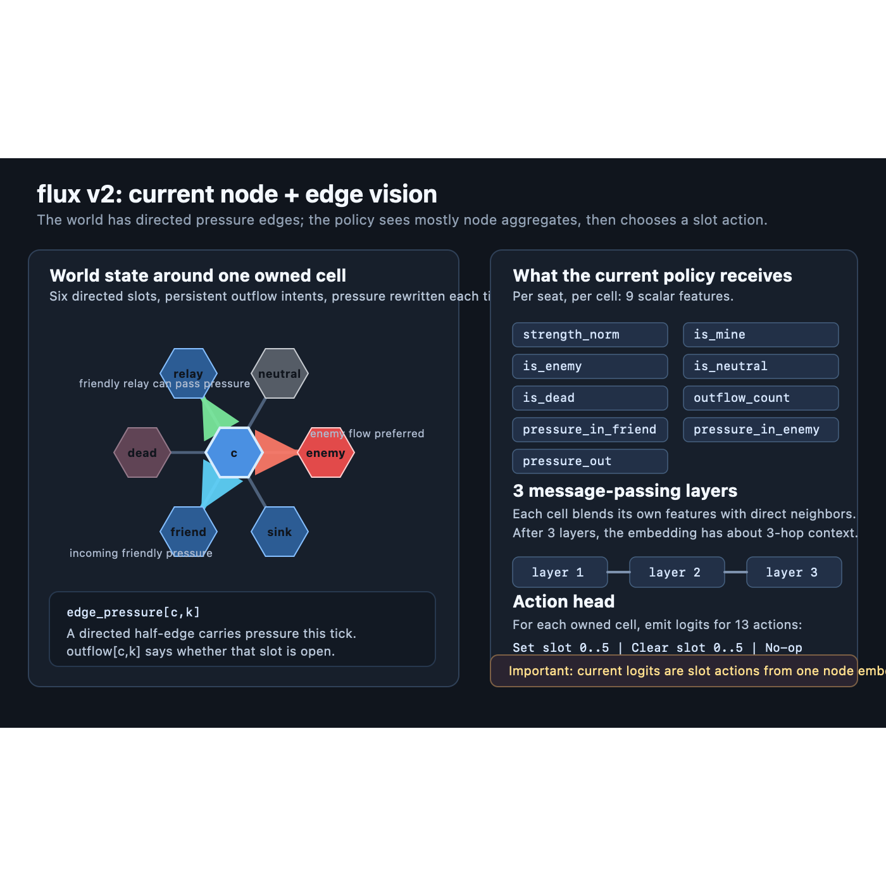

## What

flux v2 is a pressure-network game. Players own cells on a hex graph. Cells
store strength, regenerate pressure, and can open directed outflow slots to
push pressure through neighboring cells. The game is won by becoming the last
living player.

## State

Each cell has:

- `owner`: player id, neutral, or dead.
- `strength`: scalar health / stored pressure, capped by `MAX_STRENGTH`.
- `outflow[c,k]`: persistent intent for slot `k`, where `k` is one of six
  direct hex neighbors.
- `edge_pressure[c,k]`: pressure currently carried by that directed half-edge.

`outflow` is the valve position. `edge_pressure` is the pressure moving through
the valve this tick.

## Tick

Every game tick, each cell receives:

- friendly pressure from regeneration plus friendly inbound edges.
- enemy pressure from hostile inbound edges.

Friendly pressure first fills the cell up to `MAX_STRENGTH`. Any remaining
friendly pressure is overflow. Enemy pressure subtracts from strength.

If a cell has active outflows and overflow, the overflow is split across its
active slots, capped by `MAX_EDGE`, and written into next tick's
`edge_pressure`. If it has no useful place to send overflow, that pressure is
waste.

## Capture

When enemy pressure drives a cell through zero, ownership flips. The new owner
gets a foothold strength (`CAPTURE_STRENGTH`). Capturing a cell clears that
cell's old outflows, but existing neighbors may still be pointing into it.

## Actions

At AI ticks, every owned cell chooses one of 13 actions:

- `Set 0..5`: open one directed outflow slot.
- `Clear 0..5`: close one directed outflow slot.
- `No-op`: leave that cell unchanged.

Actions are idempotent: setting an already-open slot or clearing an already-
closed slot is allowed and simply changes nothing. Multi-outflow cells emerge
across multiple AI ticks.

## Invariants

- A directed outflow persists until cleared or until the origin cell is
  captured.
- Friendly bidirectional flow is resolved at action time; only one side keeps
  the edge.
- Dead cells are walls.
- Neutral and enemy cells are valid pressure targets.
- Friendly maxed cells with outflows are relays.
- Friendly maxed cells with no outflows are sinks.

## Reward Intuition

The current trainer does not reward "activity" for its own sake. v2 rewards
action-conditioned pressure work:

- power and damage work.
- captures and attributed eliminations.
- optional transit credit for pressure entering friendly relays.
- waste penalties for dead-end pressure.
- small time pressure to finish games.

The design goal is not constant leakage. The physics should allow charge,
release, pulses, follow-through, and redirection to emerge from persistent
valve choices.

## Current Policy Vision

The active PPO/GNN policy is seat-relative. For each seat and cell it receives
nine scalar features: strength, ownership flags, outflow count, friendly
inbound pressure, enemy inbound pressure, and outgoing pressure. A 3-layer GCN
mixes this node information through nearby neighbors, then emits the 13-action
logits for each cell.

Important limit: current policy vision contains aggregate cell pressure
features, not a full per-candidate-edge scoring model. The world has directed
edge pressure, but the policy's decision is still made from a node embedding.

Related: [[v2-edge-pressure-state]], [[v2-set-clear-actions]],
[[v2-three-term-reward]], [[v2-trainer-displayer]].
